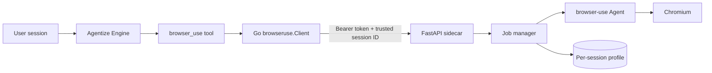

# Browser-use module

Agentize can expose an optional `browser_use` tool backed by
[browser-use](https://github.com/browser-use/browser-use). The Python agent and
Chromium run in a separate Docker container; the Go process talks to it through
the small `browseruse.Service` interface.

The integration pins `browser-use==0.13.6`. Upgrade that pin independently of
the Agentize process and run the sidecar validation before deploying.

## Why a sidecar

The upstream Docker image is designed primarily around the browser-use CLI.
Embedding the Python library behind an Agentize-owned HTTP contract gives us
job ownership, cancellation, long polling, concurrency limits, persistent browser
sessions, stable profiles,
and a bounded response format without coupling Go to Python or Chromium.



The boundary is intentionally replaceable:

- Agentize depends only on `browseruse.Service`.
- `browseruse.Client` implements that interface over HTTP.
- The sidecar owns browser-use, Chromium, API keys, queues, and profiles.
- A test double or another remote implementation can replace the client.

## Start the Docker sidecar

```bash
cd browseruse/sidecar
./run.sh init
# Add the selected provider API key to .env, then:
./run.sh
```

`run.sh` reads the selected env file without sourcing it, validates the service
token, provider-specific API key, integer ranges, and booleans, validates the
rendered Compose configuration, builds the image, and waits for the container
health check. On macOS it can start Colima when Docker is unavailable. Use
another configuration with
`./run.sh up --env-file /absolute/path/to/browser-use.env`.

Useful lifecycle commands are `./run.sh status`, `./run.sh logs`,
`./run.sh restart`, `./run.sh stop`, and `./run.sh down`.

The Compose service:

- pulls its Python base image from `docker.arvancloud.ir` by default;
- uses configurable, reachable Debian package mirrors for Chromium installation;
- binds to `127.0.0.1:8087` by default, configurable through the env file;
- injects the exact env file selected by `run.sh` into the container;
- runs as an unprivileged user with all Linux capabilities dropped;
- does not mount the Docker socket;
- uses a read-only root filesystem and writable tmpfs mounts;
- gives Chromium a dedicated 2 GiB shared-memory segment;
- persists profiles and downloads in the `browser-use-data` volume.

`BROWSER_USE_CHROMIUM_SANDBOX=false` is the container default. The container
itself is isolated and unprivileged. If the target runtime supports Chromium's
user-namespace sandbox with the current hardening flags, enable it and validate
startup there.

## Wire it into Agentize

```go
package main

import (
	"context"
	"os"
	"time"

	"github.com/ghiac/agentize"
	"github.com/ghiac/agentize/browseruse"
)

func main() {
	client, err := browseruse.NewClient(browseruse.Config{
		BaseURL: "http://127.0.0.1:8087",
		Token:   os.Getenv("BROWSER_USE_SIDECAR_TOKEN"),
	})
	if err != nil {
		panic(err)
	}

	healthContext, cancel := context.WithTimeout(context.Background(), 5*time.Second)
	defer cancel()
	if err := client.Health(healthContext); err != nil {
		panic(err)
	}

	ag, err := agentize.NewWithOptions("./knowledge", &agentize.Options{
		BrowserUse: client,
	})
	if err != nil {
		panic(err)
	}

	// Configure Agentize's main LLM as usual. The browser-use agent has its own
	// provider/model/API key, configured only in sidecar/.env.
	_ = ag
}
```

It can also be enabled or replaced at runtime:

```go
ag.UseBrowserUse(client)
```

Passing `nil` hides the schema from later LLM requests. When an existing
function registry is replaced with `UseFunctionRegistry`, Agentize
automatically re-registers the browser tool.

## Tool contract

The LLM sees one built-in function:

| Action | Inputs | Behavior |
|---|---|---|
| `run` | `task`, optional `file_ids`, `allowed_domains`, `max_steps`, `use_vision`, `wait_seconds` | Creates a job and waits up to 45 seconds by default. `file_ids` makes up to 10 session-owned user files available for browser form uploads. |
| `status` | `job_id`, optional `wait_seconds` | Returns immediately or long-polls until completion/timeout |
| `screenshot` | `job_id` | Retrieves the latest viewport captured at a completed browser step and records it as a generated, session-owned `UserFile` |
| `downloads` | `job_id` | Lists the browser files downloaded by the job. |
| `download` | `job_id`, `file_name` | Saves one file returned by `downloads` as a generated, session-owned `UserFile`. |
| `tabs` | — | Returns the current open tabs for the persistent session, including the active tab |
| `close_tab` | `tab_id` | Closes one tab returned by `tabs` and returns the updated tab snapshot |
| `cancel` | `job_id` | Cancels queued/running work while leaving the persistent browser session and its tabs open |

Jobs move through:

```text
queued -> running -> succeeded
                  -> failed
queued/running    -> cancelled
```

## Viewport quality

The sidecar exposes named desktop capture sizes so clients do not send raw
width/height:

| Quality | Size |
|---------|------|
| `hd` | 1280×720 |
| `full_hd` | 1920×1080 (default) |
| `4k` | 3840×2160 |

`GET`/`PUT /v1/session/viewport` with `{"quality":"hd"|"full_hd"|"4k"}` applies
CDP `Emulation.setDeviceMetricsOverride` on live tabs. Open pages stay alive.
The choice is persisted under the session data dir as `viewport.json`. Tab list
responses include the current `viewport` object and options.

If `run` returns before completion, its response includes the exact
`next_action` status call. Completed results include a bounded final answer,
visited URLs, step count, duration, action names, action summaries, errors, and
whether a screenshot is available. Screenshots are not copied into the LLM
context. The `screenshot` action saves the bytes through Agentize's configured
file store and returns a generated `file_id`.

The browser agent can navigate and search, click, type, scroll, switch tabs,
extract page content, inspect/select dropdowns, send keys, run page JavaScript,
and perform login and form workflows. Give `run` a precise objective rather
than prescribing individual UI actions unless they are important constraints.
The browser session is reused for later `run` calls in the same Agentize
session, so cookies, login state, and open tabs remain available. Use `tabs`
whenever the agent needs a fresh tab snapshot, then pass one returned `tab_id`
to `close_tab` when a tab should be removed. Use `status` for incomplete jobs,
`downloads` followed by `download` to return a downloaded file, and `cancel`
when the work is no longer needed.

Chat and bot integrations that want automatic attachment delivery should call
`ProcessMessageWithGeneratedFiles` instead of `ProcessMessage`:

```go
reply, tokens, generated, err := ag.ProcessMessageWithGeneratedFiles(
	ctx,
	sessionID,
	userMessage,
)
for _, file := range generated {
	data, meta, readErr := ag.ReadUserFileForUser(userID, file.FileID)
	if readErr != nil {
		continue
	}
	// Attach data using meta.Name and meta.MIMEType in the host chat SDK.
	_, _, _ = reply, tokens, data
}
_ = err
```

This wrapper returns every newly generated file from that turn, including
browser screenshots, without changing the existing `ProcessMessage` contract.
When a chatbot uses `CoreHandler`, call Core's
`ProcessMessageWithGeneratedFiles(ctx, userID, message)` instead; it observes
the user's complete file collection and therefore includes screenshots created
inside worker-agent sessions. See [FILE_MANAGER.md](FILE_MANAGER.md) for the
attachment-sender integration.

## Browser debugger

The browser debugger is documented in [BROWSER_DEBUG.md](BROWSER_DEBUG.md).

When browser-use is configured, the protected Agentize debugger includes a
**Browser** tab at:

```text
/agentize/debug/browser
```

It shows recent jobs, status, session ownership, task, duration, screenshot
availability, and bounded metadata for loaded HTTPS resources (document, script,
stylesheet, image, XHR/fetch, fonts, and other Chromium network requests).
Entries include method, URL, response status, MIME type, transferred size, and
duration. Request/response bodies, cookies, POST data, and headers are stripped
before the debug artifact remains at rest.

The page always identifies the `browser_use` tool, its actions, and whether it
is configured, connected, or waiting for a compatible sidecar. Only `run`
creates a job; `status`, `screenshot`, and `cancel` operate on an existing
`job_id`, while `tabs` and `close_tab` operate on the persistent session. Actual
invocations also appear in **Tool Calls** when the configured
session store persists tool calls. With Agentize's default tool-approval gate,
the `run` call must be approved under **Reviews** before it reaches the sidecar
and creates a browser job.

The sidecar stores one HAR metadata file and one latest-step PNG per retained
job under its data volume. Job metadata itself is in sidecar memory. Artifacts
are deleted when expired in-memory jobs are pruned under
`BROWSER_USE_JOB_TTL_SECONDS`, and restarting the sidecar clears the job list.
The debugger only requests a bounded recent window, and its screenshot proxy
remains behind Agentize admin authentication and the raw-file rate limiter.

## Session, profile, and tab behavior

The Agentize runtime injects `__session_id__`; the model cannot choose it. The
Go client sends it in `X-Agentize-Session-ID`, and the sidecar returns a job only
to that same owner. Requests for another session's job look like a normal 404.

Each session gets a hashed persistent Chromium profile under `/data/profiles` and
one in-memory `BrowserSession` under the sidecar process. This preserves cookies,
sign-in state, and open tabs between jobs without using raw session IDs as paths.
Jobs sharing one profile are serialized, while different sessions can run
concurrently up to `BROWSER_USE_MAX_CONCURRENT_JOBS`. The browser and its tabs
are closed during sidecar shutdown; individual job completion or cancellation
does not close them.

## Configuration

The sidecar fails fast when the service token, selected model, or selected
provider API key is missing.

| Variable | Default | Purpose |
|---|---:|---|
| `BROWSER_USE_COMPOSE_PROJECT` | `agentize-browser-use` | Stable Compose project/volume namespace |
| `BROWSER_USE_IMAGE_NAME` | `agentize-browser-use:local` | Locally built sidecar image name |
| `BROWSER_USE_BIND_ADDRESS` | `127.0.0.1` | Host address published by Compose |
| `BROWSER_USE_PORT` | `8087` | Host port published by Compose |
| `BROWSER_USE_STARTUP_TIMEOUT_SECONDS` | `240` | Maximum `run.sh` health wait |
| `BROWSER_USE_AUTO_START_DOCKER` | `true` | Let `run.sh` start Colima when available |
| `BROWSER_USE_PYTHON_IMAGE` | `docker.arvancloud.ir/library/python:3.12-slim` | Docker build base image/mirror |
| `BROWSER_USE_DEBIAN_MIRROR` | `https://archive.debian.petiak.ir/debian` | Main Debian APT mirror used at build time |
| `BROWSER_USE_DEBIAN_SECURITY_MIRROR` | Tsinghua Debian Security mirror | Security APT mirror used at build time |
| `BROWSER_USE_SIDECAR_TOKEN` | required | Shared HTTP bearer token |
| `BROWSER_USE_LLM_PROVIDER` | `openai` | `openai`, `browser-use`, `openrouter`, `anthropic`, or `google` |
| `BROWSER_USE_LLM_MODEL` | `gpt-5-mini` | Model used by the nested browser agent |
| `BROWSER_USE_LLM_BASE_URL` | empty | Optional OpenAI/OpenRouter/Anthropic-compatible endpoint |
| `BROWSER_USE_MAX_CONCURRENT_JOBS` | `2` | Global concurrent Chromium tasks |
| `BROWSER_USE_MAX_STEPS` | `50` | Default agent step ceiling |
| `BROWSER_USE_JOB_TIMEOUT_SECONDS` | `600` | Hard wall-clock timeout |
| `BROWSER_USE_JOB_TTL_SECONDS` | `3600` | Retention for completed in-memory job metadata |
| `BROWSER_USE_MAX_JOBS` | `1000` | In-memory job capacity |
| `BROWSER_USE_HEADLESS` | `true` | Run Chromium without a visible window |
| `BROWSER_USE_DEFAULT_USE_VISION` | `true` | Default screenshot use |
| `BROWSER_USE_BLOCK_IP_ADDRESSES` | `true` | Reject IP-literal navigation, including localhost/private IPs |
| `BROWSER_USE_PROXY_URL` | empty | Optional proxy for Chromium traffic; overrides `http_proxy` and `HTTP_PROXY` |
| `BROWSER_USE_ALLOWED_DOMAINS` | empty | Operator-controlled navigation allowlist |
| `BROWSER_USE_PROHIBITED_DOMAINS` | empty | Operator-controlled navigation denylist |

Provider keys are `OPENAI_API_KEY`, `BROWSER_USE_API_KEY`,
`OPENROUTER_API_KEY`, `ANTHROPIC_API_KEY`, or `GOOGLE_API_KEY`.

For a shared proxy configuration, set `http_proxy` in the selected sidecar env
file (or export it before running `run.sh`). Chromium uses it automatically.
Set `BROWSER_USE_PROXY_URL` only when the browser should use a different proxy.

## Security policy

For production, set `BROWSER_USE_ALLOWED_DOMAINS`. That deployment-wide list is
authoritative and overrides the allowlist proposed by a tool call. With no
operator allowlist, the per-job list is passed to browser-use. IP-literal
navigation is blocked by default to reduce SSRF exposure.

The sidecar token authenticates Agentize, while the trusted session header
authorizes each job. Keep the port private or add TLS/mTLS when the sidecar is
on another host. Never pass provider API keys through tool arguments.

Agentize's normal human-approval and callback gates still run before each
`browser_use` invocation. The browser-use agent's internal clicks and form
submissions happen inside the approved browser job, so the task text and domain
policy should describe the permitted scope precisely.

## API

The sidecar exposes:

```text
GET  /health
POST /v1/jobs
GET  /v1/jobs/{job_id}?wait_seconds=0..60
GET  /v1/jobs/{job_id}/screenshot
POST /v1/jobs/{job_id}/cancel
GET  /v1/tabs
POST /v1/tabs/{tab_id}/close
GET  /v1/debug/jobs?limit=1..100&load_limit=0..250
```

All `/v1` endpoints require `Authorization: Bearer ...`.
The job/status/cancel/screenshot and tab endpoints also require
`X-Agentize-Session-ID`; the debug-list endpoint is an operator endpoint used
only by the protected Agentize debugger. `/health` is intentionally
unauthenticated for container orchestration.

## Validation

```bash
GOCACHE=/tmp/agentize-go-build go test ./browseruse ./engine
PYTHONPYCACHEPREFIX=/tmp/agentize-browser-use-pyc \
  python3 -m compileall -q browseruse/sidecar/app
docker compose -f browseruse/sidecar/docker-compose.yml config --quiet
(cd browseruse/sidecar && ./run.sh config)
docker build -t agentize-browser-use:test browseruse/sidecar
docker run --rm -w /source -v "$PWD/browseruse/sidecar:/source:ro" \
  -e PYTHONPATH=/source agentize-browser-use:test \
  python -m unittest discover -s /source/tests -v
```

An end-to-end browser job also requires a valid provider key and outbound
network access. Test it first against a harmless domain allowlist such as
`example.com`.
